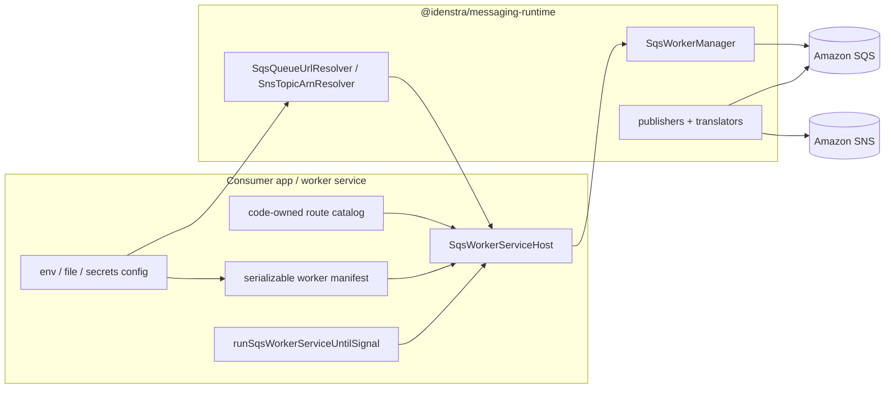

# messaging-runtime

`messaging-runtime` is Idenstra's dedicated private-first home for the shared TypeScript SNS/SQS messaging runtime.

## Features

- SQS worker runtime with bounded concurrency, long polling, visibility heartbeats, and graceful shutdown
- route-level decode, failure, timeout, and keep/delete ack control
- manifest-driven worker host bootstrap for app-owned worker services
- signal runner ergonomics for consumer-owned worker entrypoints
- SNS-over-SQS and plain SQS JSON decoding helpers
- cached SQS queue and SNS topic resolution with optional preload data
- JSON-oriented SQS and SNS publisher helpers
- optional Nest lifecycle and logger adapter through `@idenstra/messaging-runtime/nest`

Current state:
- single package surface: `@idenstra/messaging-runtime`
- root entrypoint exposes the worker runtime core, worker host/bootstrap helpers, and SNS/SQS transport helpers
- Nest integration is exposed as the optional subpath `@idenstra/messaging-runtime/nest`
- framework adapters are kept separate from core runtime files under `src/adapters/`
- extracted worker runtime core now lives here
- route-level failure policy and error hooks now live in the core runtime
- handler timeout control and runtime metrics/snapshot hooks now live in the core runtime
- manifest-driven worker host activation and signal runner ergonomics now live in the root package
- root-exported SNS/SQS translators, cached resolvers, and JSON publisher helpers now live here
- resolver config may be preloaded by the consumer at startup; the library does not read env/files directly
- private-first release automation and exact-version consumer policy now live in the repo harness
- no business handlers live here
- consumer adoption is still deferred until later slices

Supported imports are intentionally narrow:
- `@idenstra/messaging-runtime`
- `@idenstra/messaging-runtime/core`
- `@idenstra/messaging-runtime/nest`

## Purpose

This repo will own:
- the shared SNS/SQS polling/runtime core
- route-level failure policy and timeout control
- lightweight runtime event hooks and health/readiness snapshots
- worker-service host/bootstrap APIs for app-owned workers
- SNS/SQS-specific publisher and envelope helpers
- worker host/bootstrap ergonomics for app-owned worker services
- package-level tests and verification for the shared runtime

This repo will not own:
- app-specific persistence or SES business logic
- generic broker abstractions across unrelated transports
- consumer-specific handlers or payload contracts

## Quick start

```bash
npm ci
npm test
npm run build
make audit
make verify-fast
make verify
```

## Versioning

`messaging-runtime` uses the standard `major.minor.patch` shape from SemVer.

Current policy:
- the package is still pre-`1.0`, so published versions stay in the `0.minor.patch` range for now
- patch releases are for compatible fixes, packaging corrections, and non-breaking maintenance
- minor releases are for additive public surface changes and may also carry intentional pre-`1.0` breaking changes
- internal consumers must pin exact versions while the package remains `0.x`

`1.0.0` should happen only once the core runtime, transport helpers, release posture, and first consumer migrations have stabilized enough that we want stricter compatibility guarantees.

## How it fits into a system



Boundary:
- the consumer app owns configuration loading, dependency wiring, route business logic, and the process entrypoint
- `messaging-runtime` owns queue mechanics, activation rules, lifecycle handling, transport helpers, and adapter conveniences

## How to use

Typical adoption flow:
1. Create AWS SDK clients and wrap them with the runtime transport adapters.
2. Load queue/topic identifiers from env, files, or secrets in the consumer app.
3. Preload any known queue/topic mappings into the resolvers.
4. Define the route catalog in code.
5. Parse a manifest that enables only the routes this worker process should own.
6. Construct `SqsWorkerServiceHost` and run it until signal.
7. Use the translator and publisher helpers anywhere the consumer needs transport plumbing, rather than reimplementing SNS/SQS parsing and publishing.

Recommended mental model:
- use the root package for worker runtime, host, manifest, resolver, translator, and publisher concerns
- use `@idenstra/messaging-runtime/nest` only when you want Nest lifecycle wiring and logger bridging
- keep domain contracts outside the library; the package should see transport payloads, not application policies

## Worker host/bootstrap

Build a consumer-owned worker entrypoint with manifest-driven activation:

```ts
import {
  AwsSqsTransportClient,
  SqsQueueUrlResolver,
  SqsWorkerServiceHost,
  parseSqsWorkerServiceManifest,
  runSqsWorkerServiceUntilSignal,
} from '@idenstra/messaging-runtime';
import { SQSClient } from '@aws-sdk/client-sqs';

const sqsClient = new AwsSqsTransportClient(new SQSClient({ region: 'us-east-1' }));
const queueResolver = new SqsQueueUrlResolver(sqsClient, {
  preload: {
    'dispatch-queue': 'https://sqs.us-east-1.amazonaws.com/123456789012/dispatch-queue',
  },
});

const manifest = parseSqsWorkerServiceManifest({
  defaults: { concurrency: 4 },
  routes: {
    dispatch: {
      queue: 'dispatch-queue',
      config: { waitTimeSeconds: 5 },
    },
  },
});

const host = new SqsWorkerServiceHost({
  client: sqsClient,
  queueResolver,
  manifest,
  routes: [
    {
      name: 'dispatch',
      handle: async ({ payload }) => {
        console.log(payload);
      },
    },
  ],
});

await runSqsWorkerServiceUntilSignal(host);
```

Bootstrap boundary:
- the app owns env/files/secrets loading and the final process entrypoint
- the runtime owns manifest parsing, route activation, queue resolution, lifecycle, and signal-driven shutdown
- the library does not dynamically load handlers or config sources

## Nest integration

Nest support is optional and intentionally thin.

What it provides:
- `OnModuleInit` / `OnModuleDestroy` lifecycle wiring for a worker manager or worker service host
- a small logger adapter that maps runtime logs onto a Nest `LoggerService`
- less repeated bootstrap code in Nest-based consumers

What it does not provide:
- higher throughput
- different queue semantics
- different retry/timeout behavior
- any dependency on Nest inside the core runtime or host layer

Example:

```ts
import { Injectable, Logger } from '@nestjs/common';
import { SQSClient } from '@aws-sdk/client-sqs';
import {
  AwsSqsTransportClient,
  SqsQueueUrlResolver,
  SqsWorkerServiceHost,
  parseSqsWorkerServiceManifest,
} from '@idenstra/messaging-runtime';
import { AbstractNestSqsWorkerHost } from '@idenstra/messaging-runtime/nest';

@Injectable()
export class DispatchWorkerService extends AbstractNestSqsWorkerHost {
  constructor() {
    const sqsClient = new AwsSqsTransportClient(new SQSClient({ region: 'us-east-1' }));
    const queueResolver = new SqsQueueUrlResolver(sqsClient, {
      preload: {
        'dispatch-queue': 'https://sqs.us-east-1.amazonaws.com/123456789012/dispatch-queue',
      },
    });

    const manifest = parseSqsWorkerServiceManifest({
      routes: {
        dispatch: {
          queue: 'dispatch-queue',
        },
      },
    });

    const host = new SqsWorkerServiceHost({
      client: sqsClient,
      queueResolver,
      manifest,
      managerOptions: {
        logger: new Logger('DispatchWorker'),
      },
      routes: [
        {
          name: 'dispatch',
          handle: async ({ payload }) => {
            console.log(payload);
          },
        },
      ],
    });

    super(host);
  }
}
```

## Transport helpers

Decode a plain SQS JSON body:

```ts
import { decodeSqsJsonBody } from '@idenstra/messaging-runtime';

const payload = decodeSqsJsonBody<{ jobId: string }>(message.body);
```

Decode an SNS notification delivered through SQS:

```ts
import { decodeSnsNotificationJson } from '@idenstra/messaging-runtime';

const { envelope, payload } = decodeSnsNotificationJson<{ eventType: string }>(message.body);
```

Resolve queue or topic identifiers and publish JSON:

```ts
import {
  AwsSnsTransportClient,
  AwsSqsTransportClient,
  SnsPublisher,
  SqsPublisher,
} from '@idenstra/messaging-runtime';
import { SNSClient } from '@aws-sdk/client-sns';
import { SQSClient } from '@aws-sdk/client-sqs';

const sqsPublisher = new SqsPublisher(new AwsSqsTransportClient(new SQSClient({ region: 'us-east-1' })));
await sqsPublisher.sendJson({
  queue: 'dispatch-queue',
  payload: { jobId: 'job-1', messageId: 'message-1' },
});

const snsPublisher = new SnsPublisher(new AwsSnsTransportClient(new SNSClient({ region: 'us-east-1' })));
await snsPublisher.publishJson({
  topic: 'runtime-events',
  payload: { eventType: 'DELIVERY' },
});
```

Preload resolver mappings from worker/app config:

```ts
import { SqsQueueUrlResolver, SqsPublisher, AwsSqsTransportClient } from '@idenstra/messaging-runtime';
import { SQSClient } from '@aws-sdk/client-sqs';

const sqsClient = new AwsSqsTransportClient(new SQSClient({ region: 'us-east-1' }));
const queueResolver = new SqsQueueUrlResolver(sqsClient, {
  preload: {
    'dispatch-queue': 'https://sqs.us-east-1.amazonaws.com/123456789012/dispatch-queue',
  },
  allowNetworkLookup: false,
});

const publisher = new SqsPublisher(sqsClient, queueResolver);
```

Configuration boundary:
- apps/workers may load queue/topic mappings from env, files, manifests, or secrets before boot
- `messaging-runtime` does not load config sources directly
- resolver caches are only process-local memoization layered on top of injected config and lookups

Migration note:
- some consumers still carry transitional SNS/SQS plumbing
- moving those consumers onto this package is intentionally tracked outside package-facing docs

## Canonical docs

- [AGENTS.md](AGENTS.md)
- [WORKFLOW.md](WORKFLOW.md)
- [docs/HARNESS.md](docs/HARNESS.md)
- [docs/ARCHITECTURE.md](docs/ARCHITECTURE.md)
- [docs/USAGE.md](docs/USAGE.md)
- [docs/RELEASES.md](docs/RELEASES.md)
- [docs/COMPATIBILITY.md](docs/COMPATIBILITY.md)
- [docs/EXECUTION_PLANS.md](docs/EXECUTION_PLANS.md)
- [docs/ISSUE_TRACKING.md](docs/ISSUE_TRACKING.md)

## Packaging posture

- package name: `@idenstra/messaging-runtime`
- registry posture: GitHub Packages, private-first
- publication is operator-driven through the guarded manual release workflow
- version posture: `0.x`
- internal consumers pin exact versions while the package stays `0.x`
- `package.json` version is the release version source of truth and must match `CHANGELOG.md`
- OSS readiness is explicitly deferred
- public-release posture is deferred to `#11`
