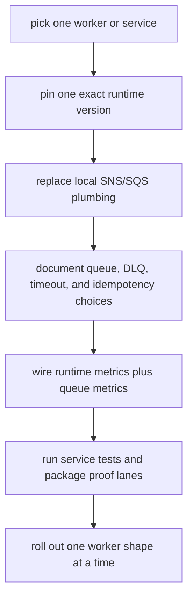

# Adoption

Use this guide when you are embedding `@idenstra/messaging-runtime` into an existing service, not just trying the library in isolation.

The goal is to adopt one worker shape at a time without hiding queue semantics, idempotency, or rollout risk.

## Adoption flow

## Recommended rollout checklist

1. Pick one worker repo or service as the first adopter.
2. Pin an exact `@idenstra/messaging-runtime` version.
3. Replace local SNS/SQS plumbing incrementally instead of rewriting several worker shapes at once.
4. Document queue, DLQ, visibility, timeout, and idempotency decisions in the consumer service.
5. Wire runtime metrics and queue metrics before wider rollout.
6. Run the consumer service tests.
7. Run LocalStack proof where the service topology maps well to the emulator lane.
8. Run live AWS smoke for the service's real topology when the change depends on real AWS behavior.
9. Roll out one worker shape at a time.

## Start with one worker shape

Good first adopters:

- a plain SQS JSON worker
- a small SNS-over-SQS notification consumer
- a publisher path that already has explicit queue/topic ownership

Bad first adopters:

- several unrelated queues in one migration batch
- workers with unclear idempotency behavior
- workers whose current queue settings are undocumented

## Version discipline

While the package remains pre-`1.0`, consumers should:

- pin exact versions
- read the changelog on every upgrade
- run their own build, tests, and harness after every upgrade
- avoid loose semver ranges by default

See [`COMPATIBILITY.md`](COMPATIBILITY.md) for the current consumer policy.

## Document operational choices in the consumer service

Before rollout, write down:

- queue name or queue binding source
- DLQ name and redrive ownership
- visibility timeout
- handler timeout strategy
- concurrency
- idempotency key or duplicate-handling approach
- keep/delete failure policy
- alerting and dashboard expectations

This library owns reusable runtime mechanics. It does not own the service's domain-safe recovery policy.

## Metrics and readiness

Before broad adoption, make sure the consumer service can answer:

- Is the worker started and healthy?
- Is queue depth rising?
- Is oldest-message age rising?
- Are handler failures or timeouts increasing?
- Are delete or heartbeat failures appearing?
- Is DLQ depth growing?

Recommended split:

- package runtime metrics and traces through [`OBSERVABILITY.md`](OBSERVABILITY.md)
- AWS-native queue metrics for queue depth, age, and DLQ pressure

## Testing ladder

Use the smallest proof layer that answers the question:

1. deterministic repo/service tests first
2. LocalStack when end-to-end SNS/SQS behavior matters and emulator support is good enough
3. observability-local proof when OTEL metrics, traces, or propagation changed
4. live AWS smoke when the behavior depends on real AWS semantics or before a real package publish

See:

- [`TESTING.md`](TESTING.md)
- [`AWS_SMOKE.md`](AWS_SMOKE.md)

## Roll out incrementally

Prefer this sequence:

1. one worker shape
2. one service
3. one environment
4. then broader adoption

Do not combine:

- worker migration
- queue setting changes
- idempotency changes
- observability rewiring
- infrastructure policy changes

into one opaque rollout if you can avoid it.

## What stays consumer-owned

Even after adoption, the service still owns:

- environment and secrets loading
- business handlers and payload contracts
- idempotency storage
- queue/DLQ provisioning
- IAM policy decisions
- consumer-owned manual reprocessing policy
- deployment topology

`messaging-runtime` should make SNS/SQS behavior reusable. It should not absorb service-specific workflow policy.
