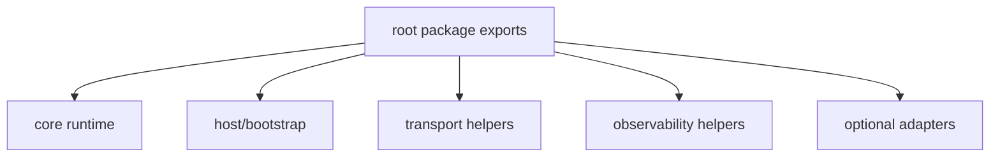
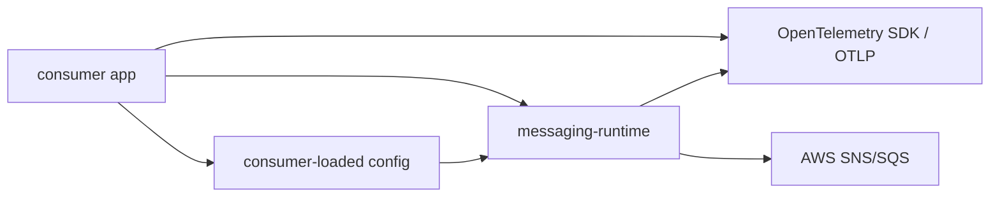

# Architecture

`messaging-runtime` owns the shared TypeScript SNS/SQS runtime layer used by app-owned worker services.

Owned surfaces:
- queue polling/runtime behavior
- shared route lifecycle hooks for startup, readiness, stop-signal, and cleanup
- route-level failure policy and timeout semantics
- runtime event hooks and status/snapshot surfaces
- OTEL metrics/tracing helpers and W3C trace propagation helpers
- worker-service host/bootstrap and signal-runner ergonomics
- explicit SNS/SQS transport helpers
- queue inspection and native DLQ redrive task helpers
- worker host/bootstrap ergonomics
- package-level verification and documentation

Not owned here:
- domain handlers
- app persistence
- SES/communication business policies
- broker abstractions for Kafka, RabbitMQ, or other unrelated transports

Current state:
- single package
- private-first
- extracted SQS worker runtime core now lives here
- the runtime core now owns route error hooks, timeout strategies, and metrics/snapshot hooks
- the runtime core now also owns:
  - bounded per-route raw-message prefetch
  - pre-dispatch visibility-age protection for buffered messages
  - route-local delete batching for worker-core finalization
- the root package now owns worker-service lifecycle/bootstrap helpers:
  - manifest-driven route activation
  - queue binding resolution through injected resolver state
  - signal-driven runner ergonomics for consumer-owned entrypoints
- the optional Nest adapter remains a consumer-facing convenience layer only:
  - module lifecycle integration
  - logger bridging
  - no runtime-semantic or performance divergence from framework-agnostic usage
  - adapter implementation stays separated from core runtime files
- the root package now owns:
  - SQS JSON body decoding
  - SNS-over-SQS envelope decoding
  - cached SQS queue URL resolution from name, URL, or ARN
  - cached SNS topic ARN resolution from name or ARN
  - JSON-oriented SQS/SNS publisher helpers
  - explicit SNS structured topic publishing helpers
  - queue inspection and normalized queue attribute snapshots
  - native SQS DLQ redrive task management
  - observability helpers exported from `@idenstra/messaging-runtime/observability`
    - OTEL metrics mapping from runtime events
    - snapshot-derived observable metrics
    - W3C trace-context injection/extraction helpers
    - consumer span wrappers for worker handlers
  - combined AWS adapter setup for consumer-facing SQS and SNS wiring
- resolver preload configuration is consumer-owned:
  - apps may inject known queue/topic mappings at startup
  - apps may disable runtime network lookup for strict environments
  - the library itself does not read env files, manifests, or secrets
- worker boot remains consumer-owned:
  - apps declare handlers in code
  - apps load manifests/config from env/files/secrets
  - apps provide the final worker process entrypoint
- consumer adoption still follows in later slices

Public package contract:
- package-facing docs describe only the supported SNS/SQS runtime surface
- cross-repo migration status belongs in issues, not in library docs
- consumer examples should stay neutral and reusable

## Extension seams

The package is intentionally extensible, but only through supported SNS/SQS-native seams.

Preferred seams:
- capability interfaces such as `SqsRuntimeClient`, `SqsTransportClient`, `SqsQueueOperationsClient`, and `SnsTransportClient`
- root-level helper composition over publishers, resolvers, queue ops, route factories, and forwarding helpers
- `SqsWorkerServiceLifecycle` for framework or process lifecycle bridges
- `@idenstra/messaging-runtime/observability` for OTEL and vendor-specific wiring

Unsupported extension style:
- deep imports into internal package files
- provider-neutral broker abstractions
- provisioning or IAM helpers in the shared package surface

For the consumer-facing extension guide, see [`EXTENDING.md`](EXTENDING.md).

## Internal structure

## Consumer integration shape

This separation is deliberate:
- consumer apps remain responsible for business handlers and configuration sourcing
- consumer apps remain responsible for manual replay, idempotency storage, and domain-safe recovery rules
- the package remains responsible for reusable SNS/SQS runtime mechanics
- the package treats SNS string-mode JSON publishing and SNS structured topic publishing as distinct semantics:
  - JSON convenience publishing stays string-mode
  - `MessageStructure: 'json'` is an explicit opt-in helper path
- the package treats buffered state as process-local runtime state:
  - per-route `buffered`
  - manager `totalBuffered`
  - no distributed backlog ledger inside the package
