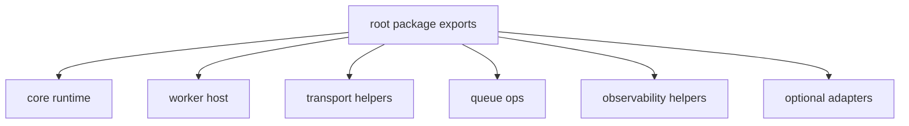
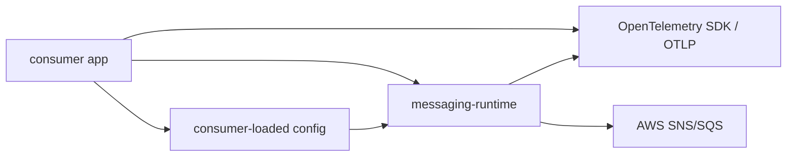

# Architecture

`messaging-runtime` is the shared SNS/SQS runtime layer for app-owned worker services.

The architecture stays intentionally narrow: reusable transport/runtime mechanics belong here; business handlers, infrastructure ownership, and transport-neutral abstractions do not.

## Owned surfaces

The package owns:

- worker runtime behavior
  - polling
  - concurrency
  - timeouts
  - heartbeats
  - shutdown
  - route lifecycle
  - runtime events and snapshots
- worker host ergonomics
  - manifest-driven route activation
  - queue binding resolution
  - signal-runner helpers
- transport helpers
  - route factories
  - decoders
  - publishers
  - forwarding handlers
  - queue/topic resolution and discovery
- queue ops
  - queue inspection
  - DLQ source listing
  - native redrive
- observability helpers
  - OTEL metrics mapping
  - snapshot-derived gauges
  - W3C propagation helpers
  - worker tracing wrappers
- optional adapters
  - Nest lifecycle and logger bridge

## Not owned here

The package does not own:

- domain handlers
- application payload contracts
- persistence or idempotency storage
- queue/topic provisioning
- IAM policy management
- transport-neutral abstractions
- consumer-owned manual reprocessing policy

Those stay consumer-owned by design.

## Public package contract

Supported imports are:

- `@idenstra/messaging-runtime`
- `@idenstra/messaging-runtime/core`
- `@idenstra/messaging-runtime/nest`
- `@idenstra/messaging-runtime/observability`

Package-facing docs and examples should describe only those imports.

## Internal structure

This keeps the public surface narrow while still letting the implementation group stable concepts into separate modules.

## Consumer integration shape

The consumer app still owns:

- config loading
- dependency wiring
- process entrypoints
- rollout policy
- domain-safe recovery rules

The package owns the reusable SNS/SQS mechanics that sit between that app and AWS.

## Extension seams

The supported extension seams are:

- capability interfaces such as `SqsRuntimeClient`, `SqsTransportClient`, `SqsQueueOperationsClient`, and `SnsTransportClient`
- root-level composition over publishers, resolvers, queue ops, route factories, and forwarding helpers
- `SqsWorkerServiceLifecycle` for framework or process lifecycle bridges
- `@idenstra/messaging-runtime/observability` for OTEL and vendor-specific wiring

Unsupported extension style:

- deep imports into internal package files
- transport-neutral abstractions
- provisioning or IAM helpers inside the shared package

See [`EXTENDING.md`](EXTENDING.md) for the consumer-facing extension guide and compile-checked examples.
