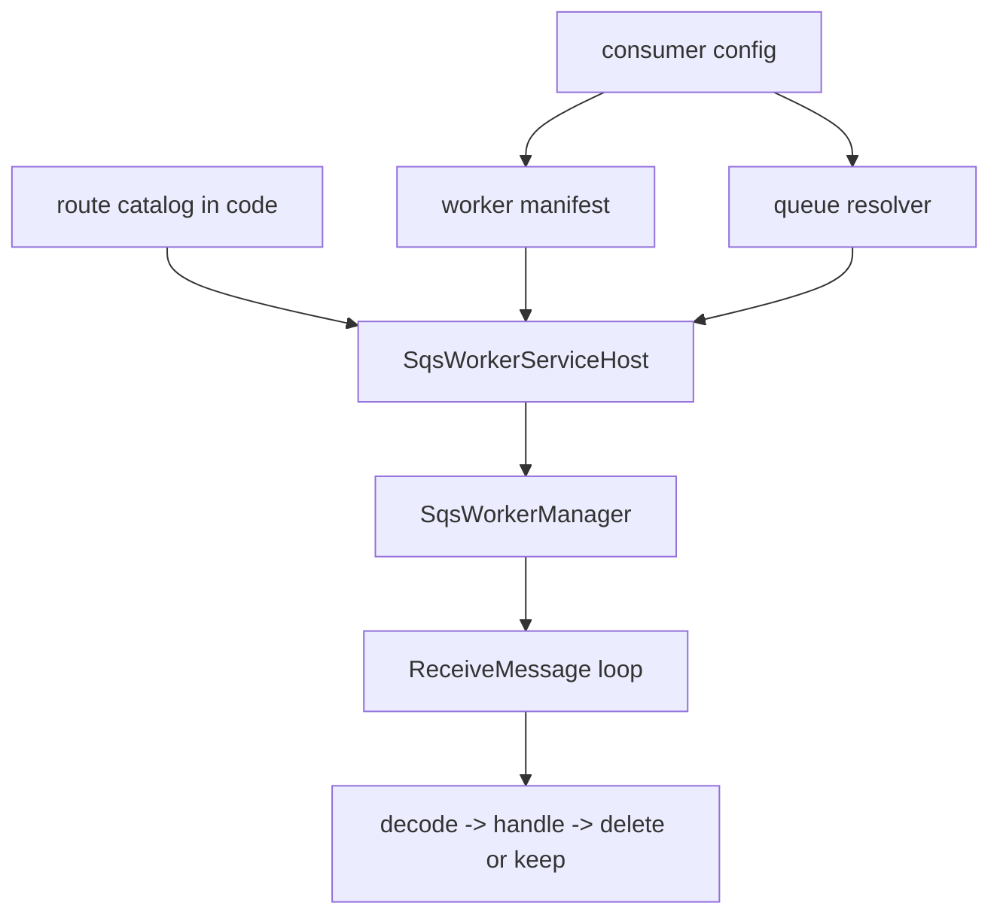
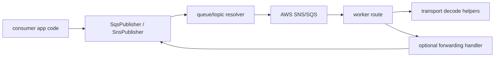
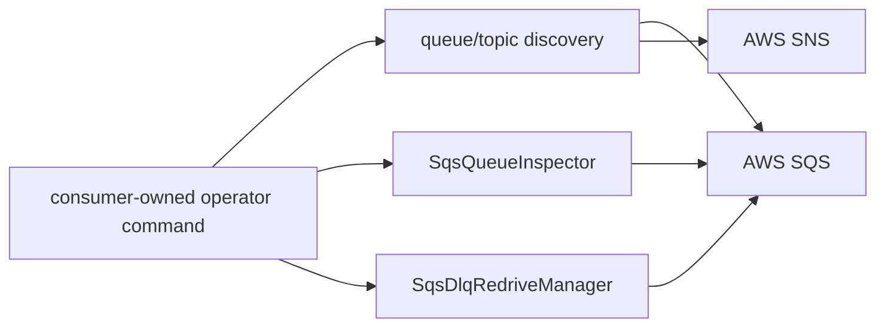

# Usage

This is the conceptual overview for `@idenstra/messaging-runtime`.

Use it when you want the mental model first. Use [`QUICK_START.md`](QUICK_START.md) for the shortest first-run path and [`GETTING_STARTED.md`](GETTING_STARTED.md) for cookbook recipes.

## The package in one sentence

`messaging-runtime` gives consumer services a reusable SNS/SQS runtime layer without taking over business handlers, infrastructure provisioning, or transport-neutral abstractions.

## Terminology

Use these terms consistently when reading or extending the package:

- `worker runtime`: polling, buffering, delete/keep, heartbeat, timeout, shutdown, snapshots, and runtime events
- `worker host`: manifest-driven route activation and hosted worker bootstrap
- `decode`: inbound SQS/SNS body or envelope parsing
- `serialize`: outbound payload-to-string transformation
- `send` vs `publish`: SQS sends messages; SNS publishes messages
- `queue ops`: queue discovery, inspection, and native redrive helpers
- `native redrive` vs `consumer-owned manual reprocessing`: the package owns SQS move-task recovery, while domain-aware reprocessing stays in the consuming system
- `proof lane`: an optional verification layer such as LocalStack, observability-local, or live AWS smoke
- `public self-test`: the outside-consumer live AWS smoke path
- `maintainer workflow`: the upstream-only GitHub OIDC and release-gate path

## Capability map

The package is easiest to reason about in five groups:

1. worker runtime
   - polling
   - concurrency
   - heartbeats
   - timeouts
   - shutdown
   - route lifecycle
   - runtime events and snapshots
2. worker host
   - manifest-driven route activation
   - queue binding resolution
   - signal-driven runner ergonomics
3. transport helpers
   - route factories
   - decoders
   - publishers
   - forwarding handlers
   - queue/topic resolution and discovery
4. queue ops
   - queue inspection
   - DLQ source listing
   - native DLQ redrive
5. optional integrations
   - Nest lifecycle/logger bridge
   - OTEL metrics/tracing helpers under `@idenstra/messaging-runtime/observability`

## Worker-service flow

The service still owns configuration and process entrypoints. The package owns reusable SNS/SQS execution behavior.

## Transport-helper flow

This is why the library stays SNS/SQS-specific: queue visibility, delete semantics, redelivery, SNS structured publishing, and native redrive all matter directly.

## Queue-ops flow

Queue ops stay read-only or transport-native:

- discovery is read-only
- queue inspection is read-only
- native redrive is package-owned
- consumer-owned manual reprocessing remains outside the package

## Recommended integration pattern

Use the package in this order:

1. load config in the consumer app
2. construct AWS SDK clients
3. wrap them with the package adapters
4. preload resolver state when queue/topic mappings are already known
5. declare routes in code
6. activate them through a manifest when using the host
7. wire observability and readiness in the consumer app

This keeps configuration, rollout, and domain policy outside the shared runtime.

## What belongs where

The package should own:

- SNS/SQS runtime semantics
- worker host ergonomics
- transport-native publish/resolve/discovery helpers
- queue inspection and native redrive
- OTEL-first observability helpers

Consumer services should own:

- environment and secrets loading
- domain handlers and payload contracts
- idempotency storage
- queue/topic provisioning
- IAM policy decisions
- deployment topology
- consumer-owned manual reprocessing policy

## Where to go next

- [`GETTING_STARTED.md`](GETTING_STARTED.md) for recipes
- [`OPERATIONS.md`](OPERATIONS.md) for readiness, scaling, idempotency, and queue-ops boundaries
- [`EXTENDING.md`](EXTENDING.md) for adapter and helper composition seams
- [`OBSERVABILITY.md`](OBSERVABILITY.md) for OTEL and SigNoz wiring
