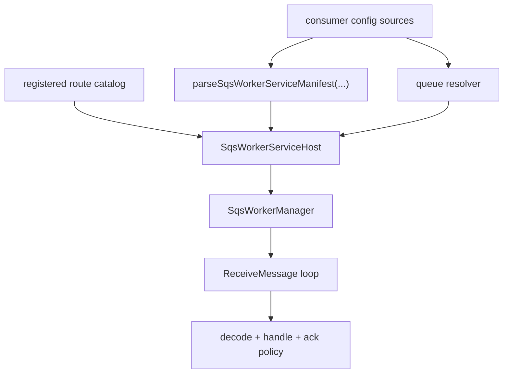
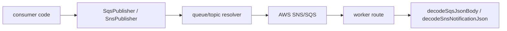
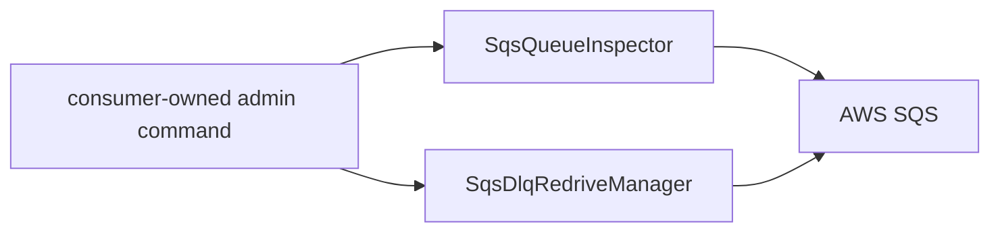

# Usage

This document is the package-facing usage guide for `@idenstra/messaging-runtime`.

## Main capabilities

The package currently provides four capability groups:

1. Worker runtime core
   - SQS polling
   - bounded concurrency
   - visibility heartbeat
   - graceful shutdown
   - shared route lifecycle hooks
   - route-level failure and timeout policy
   - runtime counters and snapshots

2. Worker host/bootstrap
   - manifest-driven route activation
   - queue binding resolution
   - signal-driven runner for app-owned worker processes

3. Transport helpers
   - plain SQS JSON decoding
   - SNS-over-SQS envelope decoding
   - cached queue/topic resolution
   - JSON SQS/SNS publishers

4. Queue operations
   - queue inspection
   - dead-letter source queue discovery
   - native DLQ redrive task management

5. Optional Nest adapter
   - Nest lifecycle glue
   - Nest logger bridging

## Recommended usage pattern

Use the package in this order:

1. Load config in the consumer app.
   - env
   - file
   - secrets manager
   - config service

2. Build AWS SDK clients in the consumer app.

3. Create AWS adapters and preload resolver state when you already know the queue/topic mapping.

4. Define handlers in code as a route catalog.

5. Parse a serializable manifest that decides which routes this worker service will activate.

6. Construct `SqsWorkerServiceHost`.

7. Start it through `runSqsWorkerServiceUntilSignal(...)` or through the optional Nest adapter.

## Worker-service flow

## Transport-helper flow

## Queue-ops flow

## Framework-agnostic usage

Choose this when:
- the worker is a plain Node process
- you want the smallest runtime surface
- you do not need Nest module lifecycle glue

Pattern:
- construct the host directly
- run it with `runSqsWorkerServiceUntilSignal(...)`

## Nest usage

Choose this when:
- the worker already lives in a Nest app
- you want `OnModuleInit` / `OnModuleDestroy` integration
- you want runtime logs bridged into a Nest `LoggerService`

Pattern:
- build the host in the provider constructor
- extend `AbstractNestSqsWorkerHost`

This is a convenience layer only. It does not change queue behavior, retry semantics, or throughput.

## Configuration boundary

The library intentionally does not:
- read env files
- read AWS Secrets Manager directly
- discover route handlers dynamically
- decide which worker processes should exist in your system

That stays with the consumer app.

The library does:
- validate the manifest and route activation rules
- resolve queue identifiers into queue URLs
- own polling, timeout, heartbeat, shutdown, and ack behavior
- provide reusable transport decoding and publish helpers
- provide reusable queue inspection and native redrive helpers

## Current non-goals

The package does not currently own:
- domain message contracts
- provider-neutral broker abstractions
- campaign or communication business logic
- generic manual message replay tooling
- direct consumer app wiring or deployment topology

Those belong in the consuming repos.
